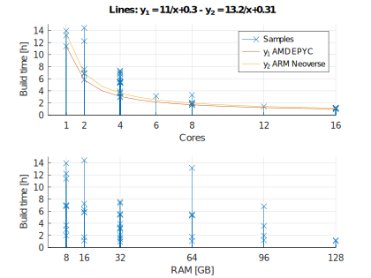
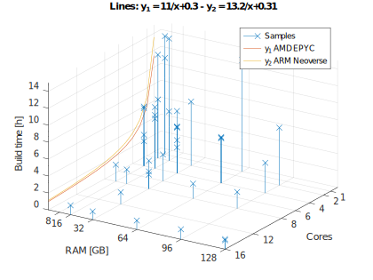

# Yocto Benchmark

The objective of this project is to benchmark hardware for Yocto Build
Machines.

The intent is to provide a base for comparison and information to allow
more robust choices when choosing hardware for a build machine.

For now, the main focus is to grasp the impact that the number of CPU
cores and the amount of RAM available have in the build time.

To achieve that we gather hardware and system information and time the
builds of the default core-image-minimal and its SDK from the kirkstone
release.

## Step 1 - Clone the repository

```console
$ git clone https://github.com/djboni/yocto-benchmark
```

## Step 2 - Install the dependencies

Installer for Ubuntu and Debian:

```console
$ ./install
```

## Step 3 - Run the benchmark

The building process will use around 70 GB of disk, downloading around
5.5 GB of source code.

```console
$ ./run
```

## Step 4 - Commit and share your results

Commit the result file and share it with a merge request or opening an
issue in our [GitHub page](https://github.com/djboni/yocto-benchmark).

```console
$ git add --all
$ git commit -m "Result description"
```

## Step 5 - Clean

Clean the build to save disk space.

```console
$ ./clean
```

# Results

Taking into account only the samples of
"Virtual Server, AMD EPYC-Rome Processor @ 2 GHz" (machines 1001 - 1009),
which were tested with 1, 2, 4, 8, and 16 cores, a couple RAM sizes each
and the same NVMe disk technology, one can suggest that the samples
follow the equation

$$ y = A / x + B $$

where `y` is the _build time_ and `x` is the _number of cores_ available.
The constants `A` and `B` reflect on the "processing" (compiling) and
the "IO" (reading and writing to disk), respectively.

It is expected the bigger RAM to be faster, allowing the OS to cache
more files. However, the tests with the same number of
cores but different RAM size, revealed a very small difference
unexpectedly in favor of the smaller RAM. (Maybe the NVMe disks are as
fast as RAM?)

Tests with (slow) HDs would allow an easier observation of the effects
of RAM caching.

From my perspective there are a few main takeaways:

- Have enough RAM to avoid swapping and being out of memory.
- Have fast enough disk (reduce `B`).
- Have more processing cores (reduce `A/x`).
- More RAM may help with caching the disk.

## Cores and RAM





| Machine | Cores | RAM GB | SSD/HD | Time     | Description                                                          |
| ------- | ----- | ------ | ------ | -------- | -------------------------------------------------------------------- |
| 1001    | 16    | 64     | NVMe   | 1h04     | Virtual Server, AMD EPYC-Rome Processor @ 2 GHz                      |
| 1003    | 16    | 32     | NVMe   | 0h59 (1) | Virtual Server, AMD EPYC-Rome Processor @ 2 GHz                      |
| 1012    | 16    | 128    | NVMe   | 1h04     | Server, Intel(R) Xeon(R) E-2288G CPU @ 3.70GHz                       |
| 1013    | 16    | 128    | NVMe   | 1h12     | Server, Intel(R) Xeon(R) E-2388G CPU @ 3.20GHz                       |
| 1101    | 16    | 96     | ?      | 1h12     | Virtual Server, ARM Neoverse-N1 @ 2GHz                               |
| 1110    | 16    | 16     | ?      | 1h07 (1) | Virtual Server, ARM Neoverse-N1 @ 2GHz                               |
| 1010    | 12    | 32     | SSD    | 1h25     | Server, Intel(R) Xeon(R) E-2286G CPU @ 4.00GHz                       |
| 1002    | 8     | 64     | NVMe   | 1h46     | Virtual Server, AMD EPYC-Rome Processor @ 2 GHz                      |
| 1004    | 8     | 32     | NVMe   | 1h40 (1) | Virtual Server, AMD EPYC-Rome Processor @ 2 GHz                      |
| 1006    | 8     | 16     | NVMe   | 1h42     | Virtual Server, AMD EPYC-Rome Processor @ 2 GHz                      |
| 1102    | 8     | 96     | ?      | 1h57     | Virtual Server, ARM Neoverse-N1 @ 2GHz                               |
| 1109    | 8     | 8      | ?      | 1h58     | Virtual Server, ARM Neoverse-N1 @ 2GHz                               |
| 1011    | 8     | 32     | SSD    | 2h02     | Server, Intel(R) Xeon(R) CPU E3-1270 v6 @ 3.80GHz                    |
| 1005    | 4     | 32     | NVMe   | 3h03     | Virtual Server, AMD EPYC-Rome Processor @ 2 GHz                      |
| 1007    | 4     | 8      | NVMe   | 2h55 (1) | Virtual Server, AMD EPYC-Rome Processor @ 2 GHz                      |
| 5.1     | 6     | 32     | SSD    | 3h08     | Server, Intel(R) Xeon(R) Bronze 3204 CPU @ 1.90GHz                   |
| 1103    | 4     | 96     | ?      | 3h34     | Virtual Server, ARM Neoverse-N1 @ 2GHz                               |
| 1108    | 4     | 8      | ?      | 3h41     | Virtual Server, ARM Neoverse-N1 @ 2GHz                               |
| 1111    | 4     | 32     | ?      | 3h54     | Virtual Server, Intel(R) Xeon(R) Platinum 8358 CPU @ 2.60GHz         |
| 1008    | 2     | 16     | NVMe   | 5h49     | Virtual Server, AMD EPYC-Rome Processor @ 2 GHz                      |
| 1       | 4     | 16     | HD     | 5h52     | Desktop, Intel(R) Core(TM) i5-3330 CPU @ 3.00GHz                     |
| 1104    | 2     | 96     | ?      | 6h48     | Virtual Server, ARM Neoverse-N1 @ 2GHz                               |
| 1107    | 2     | 8      | ?      | 6h56     | Virtual Server, ARM Neoverse-N1 @ 2GHz                               |
| 4.1     | 4     | 8      | SSD    | 6h49     | Laptop Dell Latitude E5440, Intel(R) Core(TM) i5-4200U CPU @ 1.60GHz |
| 3.1     | 4     | 8      | SSD    | 7h00     | Laptop Dell Vostro 5480, Intel(R) Core(TM) i5-5200U CPU @ 2.20GHz    |
| 2       | 4     | 16     | SSD    | 7h14     | Laptop Dell Inspiron 5547, Intel(R) Core(TM) i7-4510U CPU @ 2.00GHz  |
| 1112    | 2     | 32     | ?      | 7h33     | Virtual Server, Intel(R) Xeon(R) Platinum 8358 CPU @ 2.60GHz         |
| 1009    | 1     | 8      | NVMe   | 11h23    | Virtual Server, AMD EPYC-Rome Processor @ 2 GHz                      |
| 1105    | 1     | 64     | ?      | 13h10    | Virtual Server, ARM Neoverse-N1 @ 2GHz                               |
| 1106    | 1     | 8      | ?      | 13h57    | Virtual Server, ARM Neoverse-N1 @ 2GHz                               |

Notes:

- See the build workflow in [docs/Build-Time-Workflow.md]

- Building core-image-minimal and the SDK.

- (1) Similar setup as above with less resources, however with a
  slightly better time. Considered as equal time and ordered by
  resources.

## RAM/Swap Usage and Concurrent Builds

| Machine | Cores | RAM GB | Builds | Time     | Peak RAM+Swap | Mean | Description                                     |
| ------- | ----- | ------ | ------ | -------- | ------------- | ---- | ----------------------------------------------- |
| 1003.u1 | 16    | 32     | 1      | 0h34     | 7.6 + 0.0     | 2.7  | Virtual Server, AMD EPYC-Rome Processor @ 2 GHz |
| 1003.u2 | 16    | 32     | 2      | 1h03     | 15.7 + 0.2    | 5.8  | Virtual Server, AMD EPYC-Rome Processor @ 2 GHz |
| 1003.u4 | 16    | 32     | 4      | 2h05     | 25.0 + 0.8    | 11.4 | Virtual Server, AMD EPYC-Rome Processor @ 2 GHz |
| 1003.u6 | 16    | 32     | 6      | 3h17     | 30.4 + 7.8    | 17.5 | Virtual Server, AMD EPYC-Rome Processor @ 2 GHz |
| 1003.u8 | 16    | 32     | 8      | 4h43 (2) | 30.7 + 7.8    | 22.0 | Virtual Server, AMD EPYC-Rome Processor @ 2 GHz |
| 1006.u1 | 8     | 16     | 1      | 1h02     | 7.0 + 0.0     | 2.0  | Virtual Server, AMD EPYC-Rome Processor @ 2 GHz |
| 1007.u1 | 4     | 8      | 1      | 1h42     | 3.9 + 0.1     | 1.3  | Virtual Server, AMD EPYC-Rome Processor @ 2 GHz |
| 1008.u1 | 2     | 16     | 1      | 3h20     | 2.8 + 0.0     | 0.9  | Virtual Server, AMD EPYC-Rome Processor @ 2 GHz |
| 1009.u1 | 1     | 8      | 1      | 6h48     | 2.4 + 0.0     | 0.6  | Virtual Server, AMD EPYC-Rome Processor @ 2 GHz |

Notes:

- See the build workflow in [docs/Memory-Usage-Workflow.md]

  - For Memory Usage (one build) make NUM=1
  - For Concurrent Builds (multiple builds make NUM > 1)

- Building only core-image-minimal, skipping the SDK, for simultaneous
  builds.

- Choosing servers with as little RAM as possible to identify the
  implications of lower RAM and concurrent builds.

- Starting all simultaneous builds at the same time in the hope of
  getting the worst case scenario, where all builds need the most
  memory at the same time.

- (2) Four of the eight builds were stopped due to low memory.

# References

- [Yocto Project Quick Build](https://docs.yoctoproject.org/brief-yoctoprojectqs/index.html)
