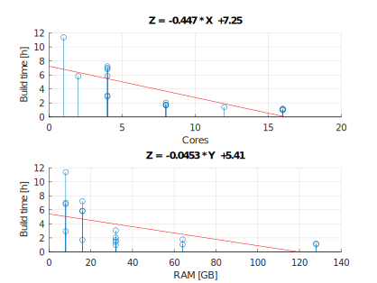

# Yocto Benchmark

The objective of this project is to benchmark hardware for Yocto Build
Machines.

The intent is to provide a base for comparison and information to allow
more robust choices when choosing hardware for a build machine.

For now, the main focus is to grasp the impact that the number of CPU
cores and the amount of RAM available have in the build time.

To achieve that we gather hardware and system information and time the
builds of the default core-image-minimal and its SDK from the kirkstone
release.

## Step 1 - Clone the repository

```console
$ git clone https://github.com/djboni/yocto-benchmark
```

## Step 2 - Install the dependencies

Installer for Ubuntu and Debian:

```console
$ ./install
```

## Step 3 - Restart and run the benchmark

Restart the computer before running the benchmark, specially if you are
rerunning it for any reason. Restarting the computer will make sure
there is the most RAM available for the build and, at the same time,
there will be no previous file system caching at the start of the build.

The building process will download around 5.5 GB of source code and it
will use about 65 GB more to build the image and SDK.

```console
$ ./run
```

## Step 4 - Commit and share your results

Commit the result file and share it with a merge request or opening an
issue in our [GitHub page](https://github.com/djboni/yocto-benchmark).

```console
$ git add --all
$ git commit -m "Result description"
```

## Step 5 - Clean

Clean the build to save disk space.

```console
$ ./clean
```

## References

- [Yocto Project Quick Build](https://docs.yoctoproject.org/brief-yoctoprojectqs/index.html)

# Results




| Machine | Cores | RAM GB | SSD/HD | Time     | Description                                                          |
| ------- | ----- | ------ | ------ | -------- | -------------------------------------------------------------------- |
| 1001    | 16    | 64     | NVMe   | 1h04     | Virtual Server, AMD EPYC-Rome Processor @ 2 GHz                      |
| 1003    | 16    | 32     | NVMe   | 0h59 (1) | Virtual Server, AMD EPYC-Rome Processor @ 2 GHz                      |
| 1012    | 16    | 128    | NVMe   | 1h04     | Server, Intel(R) Xeon(R) E-2288G CPU @ 3.70GHz                       |
| 1013    | 16    | 128    | NVMe   | 1h12     | Server, Intel(R) Xeon(R) E-2388G CPU @ 3.20GHz                       |
| 1010    | 12    | 32     | SSD    | 1h25     | Server, Intel(R) Xeon(R) E-2286G CPU @ 4.00GHz                       |
| 1002    | 8     | 64     | NVMe   | 1h46     | Virtual Server, AMD EPYC-Rome Processor @ 2 GHz                      |
| 1004    | 8     | 32     | NVMe   | 1h40 (1) | Virtual Server, AMD EPYC-Rome Processor @ 2 GHz                      |
| 1006    | 8     | 16     | NVMe   | 1h42     | Virtual Server, AMD EPYC-Rome Processor @ 2 GHz                      |
| 1011    | 8     | 32     | SSD    | 2h02     | Server, Intel(R) Xeon(R) CPU E3-1270 v6 @ 3.80GHz                    |
| 1005    | 4     | 32     | NVMe   | 3h03     | Virtual Server, AMD EPYC-Rome Processor @ 2 GHz                      |
| 1008    | 2     | 16     | NVMe   | 5h49     | Virtual Server, AMD EPYC-Rome Processor @ 2 GHz                      |
| 1       | 4     | 16     | HD     | 5h52     | Desktop, Intel(R) Core(TM) i5-3330 CPU @ 3.00GHz                     |
| 4.1     | 4     | 8      | SSD    | 6h49     | Laptop Dell Latitude E5440, Intel(R) Core(TM) i5-4200U CPU @ 1.60GHz |
| 3.1     | 4     | 8      | SSD    | 7h00     | Laptop Dell Vostro 5480, Intel(R) Core(TM) i5-5200U CPU @ 2.20GHz    |
| 2       | 4     | 16     | SSD    | 7h14     | Laptop Dell Inspiron 5140, Intel(R) Core(TM) i7-4510U CPU @ 2.00GHz  |
| 1009    | 1     | 8      | NVMe   | 11h23    | Virtual Server, AMD EPYC-Rome Processor @ 2 GHz                      |

Notes:

- (1) Similar setup as above with less resources, however with a
  slightly better time. Considered as equal time and ordered by
  resources.
